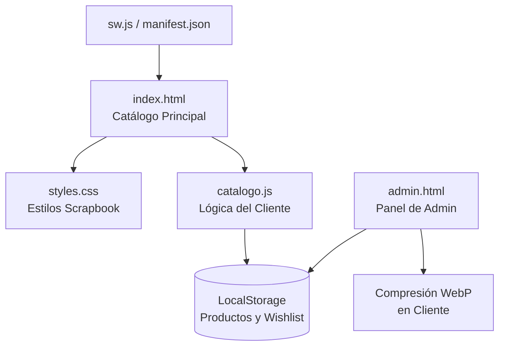

# 🏠 Inicio — Bicho Capricho (Catálogo 2026)

¡Te damos la bienvenida al espacio de trabajo de **Bicho Capricho**! Este archivo está diseñado para ser la nota principal (Home) de tu bóveda de **Obsidian**. Desde aquí puedes explorar toda la documentación, el estado de las fases de desarrollo y la arquitectura técnica del catálogo.

---

## 📓 Documentación del Proyecto

Haz clic en los enlaces para abrir las notas detalladas del catálogo en Obsidian:

* **[[REGISTRO-CATALOGO|📓 Historial Completo del Proyecto]]**: Bitácora de desarrollo detallada fase por fase, registro de assets de marca importados, base de datos y control de cambios.
* **[[walkthrough|🚀 Cambios Recientes (Fase 14)]]**: Resumen completo de las últimas funciones (typewriter estable, PWA con Service Worker, guías de medidas dinámicas, washi tapes coordinados, pestañas de admin y swatches interactivos).
* **[[auditoria_catalogo2026|🐛 Reporte de Auditoría de Bugs]]**: Auditoría exhaustiva del código fuente, resolución de bugs de rendimiento, optimizaciones WebP y adaptabilidad móvil.

---

## 🎨 Brand Kit (Identidad Bicho Capricho)

Guía rápida de colores oficiales y lineamientos visuales de la marca:

### Paleta de Colores
* **Verde Bosque:** `#1c4f32` (Aproximadamente el 60% de las superficies).
* **Crema de Fondo:** `#f8f4ec` (Usado para descanso visual y fondos limpios).
* **Amarillo Mantequilla:** `#ffd166`
* **Lila Lavanda:** `#dfbfff`
* **Morado Uva:** `#9669c4`
* **Rosa Chicle:** `#ffb4c8`
* **Verde Lima:** `#c3ec9f`
* **Verde Oliva:** `#678d47`

### Voz y Tono
* **Sí usar:** Palabras cálidas, boutique y de valor como *capricho, especial, único, sorpresa, con amor, memorable*.
* **No usar:** Términos de descuento agresivo o transaccionales como *barato, descuento, promo, normal, genérico*.

### Efecto Liquid Glass (Vidrio Esmerilado)
* **Regla de Legibilidad:** Los efectos de glassmorphism (`backdrop-filter: blur()`) solo deben ser colocados sobre fondos con color (ej. Bosque, Lavanda o Rosa). **Nunca** deben aplicarse sobre fondos neutros o blancos/crema, para conservar legibilidad y contraste.

---

## 🛠️ Arquitectura de Archivos del Catálogo

El proyecto está diseñado de forma estática (sin base de datos en servidor) para una velocidad máxima y facilidad de hosting:

### Descripción de Archivos
1. **[index.html](file:///F:/PROYECTOS/BICHO%20CAPRICHO/CATALOGO%202026/index.html)**: Estructura del catálogo dinámico, slider interactivo, modal de producto y lista de deseos (wishlist).
2. **[styles.css](file:///F:/PROYECTOS/BICHO%20CAPRICHO/CATALOGO%202026/styles.css)**: Hojas de estilos del diseño Scrapbook (marcos de puntada stitch, washi tapes, doodles y efectos liquid glass).
3. **[catalogo.js](file:///F:/PROYECTOS/BICHO%20CAPRICHO/CATALOGO%202026/catalogo.js)**: Lógica del cliente. Renderiza productos, maneja la wishlist, el comparador de productos, autocompletado en búsquedas, partículas del Hero, y animaciones de unboxing.
4. **[admin.html](file:///F:/PROYECTOS/BICHO%20CAPRICHO/CATALOGO%202026/admin.html)**: Panel de control de administración protegido por contraseña. Permite agregar, editar, eliminar productos, subir fotos de galería y configurar el número de WhatsApp de destino.
5. **[sw.js](file:///F:/PROYECTOS/BICHO%20CAPRICHO/CATALOGO%202026/sw.js)**: Service Worker que permite cargar la web sin conexión a internet y acelera los tiempos de respuesta.
6. **[manifest.json](file:///F:/PROYECTOS/BICHO%20CAPRICHO/CATALOGO%202026/manifest.json)**: Manifiesto PWA para permitir que los usuarios instalen el catálogo directamente en la pantalla de inicio de su teléfono móvil.

---

## 🚀 Guía de Lanzamiento a Producción

Cuando vayas a publicar el catálogo oficial en internet, recuerda realizar los siguientes ajustes:

1. **WhatsApp de Destino:** Ingresa al panel de administración (`admin.html`) y escribe tu número real con código de país (ej. `521XXXXXXXXXX` para México). Esto actualizará automáticamente todos los botones de cotización y wishlist en el catálogo.
2. **Contraseña del Panel:** Por seguridad, edita la línea 893 de `admin.html` (`const ADMIN_PASSWORD = 'bicho2026';`) y cambia `'bicho2026'` por una contraseña única para tu negocio.
3. **Dominio en Open Graph:** Abre `index.html` y reemplaza en la línea 35: `<meta property="og:url" content="https://bichocapricho.mx">` por el enlace del dominio real de tu sitio.
4. **Subir Archivos:** Sube todo el contenido de esta carpeta (incluyendo la carpeta `/assets`, `index.html`, `admin.html`, `styles.css`, `catalogo.js`, `sw.js` y `manifest.json`) a tu servicio de hosting HTTPS.
